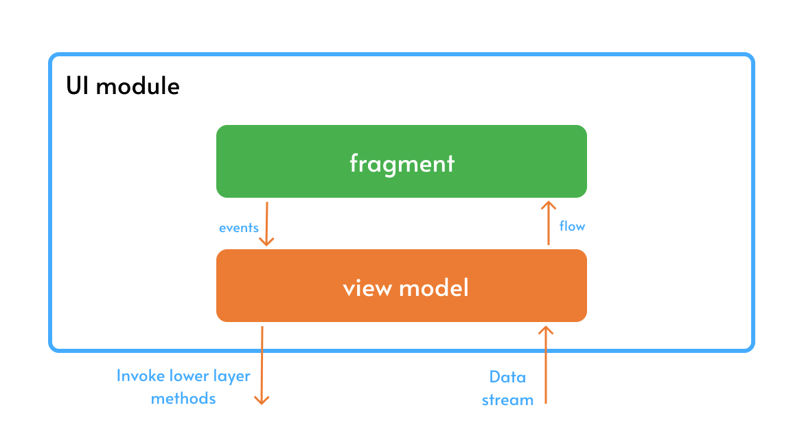
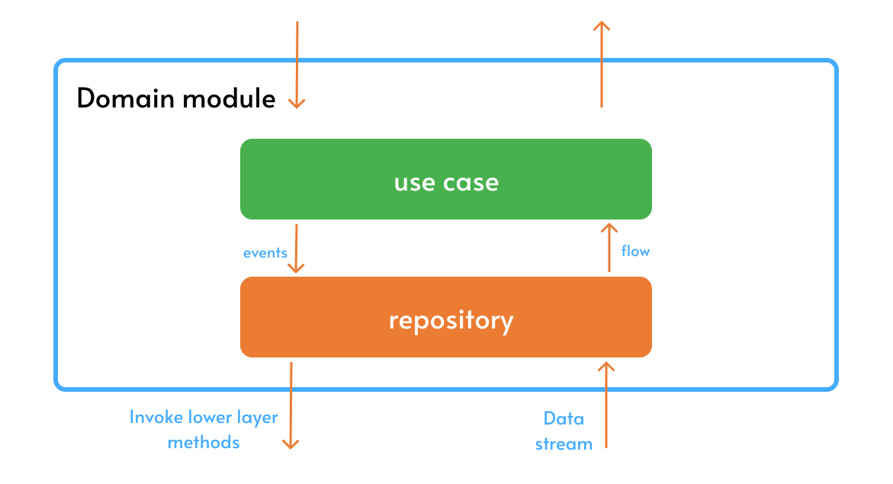
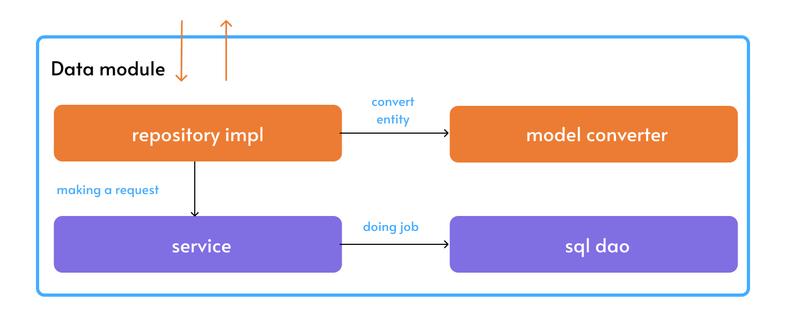

<h1 align="center">TaskMate</h1>

  
✏ TaskMate demonstrates modern Android development with Dagger, Coroutines, Flow, Jetpack (Room, ViewModel), and xml based on MVVM architecture.

## Download
The application is under development, will soon be available on [Play Market](https://play.google.com/store/apps?hl=en&gl=US), please wait

## Tech stack & Libraries
- Minimum SDK level 23
- [Kotlin](https://kotlinlang.org/) based, [Coroutines](https://github.com/Kotlin/kotlinx.coroutines) + [Flow](https://kotlin.github.io/kotlinx.coroutines/kotlinx-coroutines-core/kotlinx.coroutines.flow/) for asynchronous.
- [ViewModel](https://developer.android.com/topic/libraries/architecture/viewmodel): Manages UI-related data holder and lifecycle aware. Allows data to survive configuration changes such as screen rotations.
- [ViewBinding](https://developer.android.com/topic/libraries/view-binding): Binds UI components in your layouts to data sources in your app.
- [Room](https://developer.android.com/training/data-storage/room): Constructs Database by providing an abstraction layer over SQLite to allow fluent database access.
- [Dagger](https://github.com/google/dagger): for dependency injection.
- GJson converter to convert domain object.
- [Jetpack Navigation](https://developer.android.com/guide/navigation/get-started) to navigate between fragments.
- Architecture
  - MVVM Architecture (View - ViewBinding - ViewModel - Model)
  - Clean Architecture
  - TDD (Test-driven development) Pattern

 ## Architecture
TaskMate follows all the rules of [Clean Architecture](https://developer.android.com/topic/architecture), [TDD](https://en.wikipedia.org/wiki/Test-driven_development#:~:text=Test%2Ddriven%20development%20(TDD),software%20against%20all%20test%20cases.) and [SOLID](https://en.wikipedia.org/wiki/SOLID), which have become common development methodologies

The overall architecture of **TaskMate** consists of three layers; user interface layer, domain layer and data layer. Each level has dedicated components and each has different responsibilities

## UI module

The UI layer consists of UI elements to configure screens that could interact with users and [ViewModel](https://developer.android.com/topic/libraries/architecture/viewmodel) that holds app states and restores data when configuration changes.

## Domain module

The domain layer, also known as the business logic layer, is the core of an application. It encapsulates the business rules, processes, and calculations that represent the core functionality of the application. The domain layer is responsible for ensuring that the application adheres to the business rules and models the real-world domain that the application represents.

## Data module

The data layer, is responsible for managing and accessing data in a software application. It acts as an intermediary between the application logic and the underlying data storage systems, such as databases, files, or web services. The data layer provides a consistent and unified interface for accessing data, regardless of the specific data source or storage mechanism.

