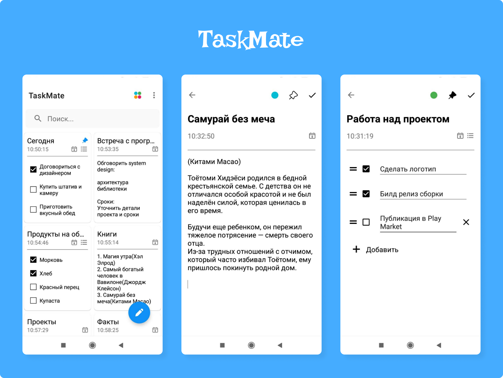

<h1 align="center">TaskMate</h1>

  
✏ TaskMate demonstrates modern Android development with Dagger, Coroutines, Flow, Jetpack (Room, ViewModel), and xml based on MVVM architecture.

## Download
The application is under development, will soon be available on [Play Market](https://play.google.com/store/apps?hl=en&gl=US), please wait

## Tech stack & Libraries
- Minimum SDK level 23
- [Kotlin](https://kotlinlang.org/) based, [Coroutines](https://github.com/Kotlin/kotlinx.coroutines) + [Flow](https://kotlin.github.io/kotlinx.coroutines/kotlinx-coroutines-core/kotlinx.coroutines.flow/) for asynchronous.
- ViewModel: Manages UI-related data holder and lifecycle aware. Allows data to survive configuration changes such as screen rotations.
- ViewBinding: Binds UI components in your layouts to data sources in your app.
- Room: Constructs Database by providing an abstraction layer over SQLite to allow fluent database access.
- [Dagger](https://github.com/google/dagger): for dependency injection.
- GJson converter to convert domain object.
- [Jetpack Navigation](https://developer.android.com/guide/navigation/get-started) to navigate between fragments.
- Architecture
  - MVVM Architecture (View - ViewBinding - ViewModel - Model)
  - Clean Architecture
  - TDD (Test-driven development) Pattern

 ## Architecture
TaskMate follows all the rules of [Clean Architecture](https://developer.android.com/topic/architecture), [TDD](https://en.wikipedia.org/wiki/Test-driven_development#:~:text=Test%2Ddriven%20development%20(TDD),software%20against%20all%20test%20cases.) and [SOLID](https://en.wikipedia.org/wiki/SOLID), which have become common development methodologies

The overall architecture of **TaskMate** consists of three layers; user interface layer, domain layer and data layer. Each level has dedicated components and each has different responsibilities
